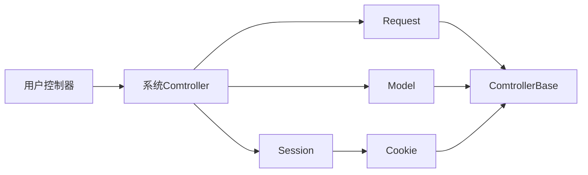

# homepy使用手册
## 一、控制器继承架构


## 二、系统架构规范
1. **整个系统采用mvc(模型/视图/控制器)模式**
2. **控制器类文件命名与类命名保持一致，一个控制器类文件对应一个类**
3. **控制器类文件命名每个单词首字母要大写**

## 三、中间件
> 用法示例：
```python
from homepy.Application import application

# 中间件
def my_middleware(request, response, call_next):
    print('我是前置操作')
    response_data = call_next(request, response)
    print('我是后置操作')
    return response_data

application.middleware = my_middleware

if __name__ == '__main__':
    application.run()
```

## 四、路由
> 使用说明：
1. **路由分默认路由和注解路由两种，默认路由时不用配置注解可以直接访问的路由**
2. **没有注解路由，采用默认路由访问,如：/模块/控制器/方法**
3. **控制器名中间如果存在大写字母，下划线+小写字母访问**
4. **多级控制器之间用点符号"."连接**
5. **注解路由传递的变量参数必须用路径函数接收，仅遵循接收顺序的一致性，即接收时变量可重命名**
> 用法示例：
```python
from homepy.route.DecoratorRoute import route
from app.common.controller.Base import Base
# /app/home/controller/order/my/GoodsOrder.py
class GoodsOrder(Base):
	# 注解路由访问url：/
    @route('/')
    def index(self) -> str:
        return '首页'
    
    # 注解路由访问url：/my-dzy
    @route('/my-{name}')
    # 用my_name接收name值
    def my(self, my_name) -> list:
        return [my_name, {'name':'大神'}]
        
	# 默认路由访问url：/home/order.my.goods_order/demo
    def demo(self) -> str:
        return 'demo'
```
## 五、控制器返回值

> python数据类型会自动转化为前端能识别的数据类型
>

## 六、内置拓展

### 6.1、cookie
> 用法示例：
```python
# 获取 cookie
self.cookie('name')
# 设置 cookie
# cookie值仅支持(字符串/整数/小数)形式
self.cookie('name', 'dzy', {'path': '/', 'max-age': 600})
```
> 参数详解:
1. 只有一个参数，是获取值

2. 2个以及两个以上是设置cookie，第一个参数是键，第二个参数是值(字符串/整数/小数)，第三个参数是cookie相关配置，用字典表示

   - **path：** cookie 匹配路径, 默认'/', 表示站点根目录下任何路径下生效

   - **max-age：**存活的秒数,默认当前会话
   - **domain ：** 指定了 Cookie 所属的域名，若没有指定Domain属性，那么其默认值就是当前域名（不包含子域名）
   - **secure：**唯一值 secure, 默认为空， 表示仅能用与 HTTPS 协议
   - **httponly：**唯一值 httponly, 默认为空，表现形式为 cookie 不能被客户端脚本javascript获取到
   - **SameSite：**  禁止第三方Cookie，默认None，SameSite=Strict 可以严格限定 Cookie 不能随着跳转链接跨站发送。SameSite=Lax 则略宽松一点，允许GET/HEAD 等安全方法，但禁止 POST 跨站发送。SameSite=None：允许使用第三方Cookie

###  6.2、session
> 用法示例：
```python
# 获取 session
self.session('name')
# 设置 session
# session值支持任意python数据类型
self.session('name', 'dzy')
```
> 参数详解:
1. 只有一个参数，是获取值
2. 2个参数是设置session，第一个参数是键，第二个参数是值(支持任意python数据类型)

### 6.3、获取请求参数

> 注：数字字符串会被自动转化为数字类型

用法示例：

```python
# 获取 name 参数
self.input('name')
# 获取所有请求参数
self.input()
```
### 6.4、文件上传

上传配置：config/Upload.py

```python
# 文件上传配置
class UploadConfig:
    # 上传路径前缀
    # 注：
    # 1.upload_path_prefix值为空，默认上传到与入口文件 main.py 同级目录下upload目录
    # 2.upload_path_prefix值不为空，则上传到： upload_path_prefix指定目录/upload
    # 3.尾部路径分隔符可不用添加
    upload_path_prefix = 'E:\\project\\nodejs\\nuxt3-c8py-admin\\public\\'

    # 上传的文件可访问域名，作为文件上传成功后的第二个参数返回
    domain = 'http://192.168.2.210:5500'
```


> 用法示例：
```python
from homepy.route.DecoratorRoute import route
from app.common.controller.Base import Base

class Upload(Base):
    url_prefix = '/api'

    '''
    接收文件上传
    '''
    @route(url_prefix + '/wangEditor')
    def wangEditor(self):
        # 参数1. 文件上传字段名
        # 参数2. 存放到上传路径下的特定目录，如：/upload/goods
        # 返回不带域名url的绝对路径和域名
        url, domain = self.upload('my_file', 'goods')
        print(url, domain)
```


### 6.5、数据库操作

#### 6.5.1 mysql

##### 6.5.1.1 query 

> 查询

```python
 obj_mysql = self.db(dbtype='mysql', active_index=0)
    result = obj_mysql.table('member').query(
            whereSql='id=?',
            whereSqlVal=[20]
        )
    # 或
    obj_mysql = self.db() # 默认使用mysql，0索引配置项
    result = obj_mysql.table('member').query(
            whereSql='id=?',
            whereSqlVal=[20]
        )
```


#### 6.5.2 mongodb

##### 6.5.2.1 query 

> ##### 查询

```python
obj_mongodb = self.db(dbtype='mongodb', active_index=0)
    result =  obj_mongodb.database('meijieyi_ziyuan').table('wangzhan_meiti_show').query(
            where={'id': '66421'},
        )
```

#### 6.5.3 sqlite

##### 6.5.3.1 query

> 查询

```python
obj_sqlite = self.db(dbtype='sqlite', active_index=0)
result = obj_sqlite.table('student').query(
        whereSql='id>?',
        whereSqlVal=[12]
    )
```


