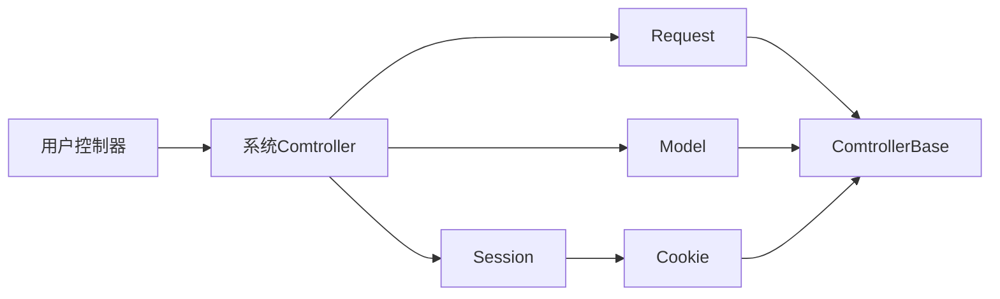

# homepy使用手册
## 一、控制器继承架构


## 二、系统架构规范
1. **整个系统采用mvc(模型/视图/控制器)模式**
2. **控制器类文件命名与类命名保持一致，一个控制器类文件对应一个类**
3. **控制器类文件命名每个单词首字母要大写**

## 三、中间件
> 用法示例：
```python
from homepy.Application import application

# 中间件
def my_middleware(request, response, call_next):
    print('我是前置操作')
    response_data = call_next(request, response)
    print('我是后置操作')
    return response_data

application.middleware = my_middleware

if __name__ == '__main__':
    application.run()
```

## 四、路由
> 使用说明：
1. **路由分默认路由和注解路由两种，默认路由时不用配置注解可以直接访问的路由**
2. **没有注解路由，采用默认路由访问,如：/模块/控制器/方法**
3. **控制器名中间如果存在大写字母，下划线+小写字母访问**
4. **多级控制器之间用点符号"."连接**
5. **注解路由传递的变量参数必须用路径函数接收，仅遵循接收顺序的一致性，即接收时变量可重命名**
> 用法示例：
```python
from homepy.route.DecoratorRoute import route
from app.common.controller.Base import Base
# /app/home/controller/order/my/GoodsOrder.py
class GoodsOrder(Base):
	# 注解路由访问url：/
    @route('/')
    def index(self) -> str:
        return '首页'
    
    # 注解路由访问url：/my-dzy
    @route('/my-{name}')
    # 用my_name接收name值
    def my(self, my_name) -> list:
        return [my_name, {'name':'大神'}]
        
	# 默认路由访问url：/home/order.my.goods_order/demo
    def demo(self) -> str:
        return 'demo'
```
## 五、控制器返回值

> python数据类型会自动转化为前端能识别的数据类型
>

## 六、控制器内置功能

### 6.1、cookie
> 用法示例：
```python
# 获取 cookie
self.cookie('name')
# 设置 cookie
# cookie值仅支持(字符串/整数/小数)形式
self.cookie('name', 'dzy', {'path': '/', 'max-age': 600})
```
> 参数详解:
1. 只有一个参数，是获取值

2. 2个以及两个以上是设置cookie，第一个参数是键，第二个参数是值(字符串/整数/小数)，第三个参数是cookie相关配置，用字典表示

   - **path：** cookie 匹配路径, 默认'/', 表示站点根目录下任何路径下生效

   - **max-age：**存活的秒数,默认当前会话
   - **domain ：** 指定了 Cookie 所属的域名，若没有指定Domain属性，那么其默认值就是当前域名（不包含子域名）
   - **secure：**唯一值 secure, 默认为空， 表示仅能用与 HTTPS 协议
   - **httponly：**唯一值 httponly, 默认为空，表现形式为 cookie 不能被客户端脚本javascript获取到
   - **SameSite：**  禁止第三方Cookie，默认None，SameSite=Strict 可以严格限定 Cookie 不能随着跳转链接跨站发送。SameSite=Lax 则略宽松一点，允许GET/HEAD 等安全方法，但禁止 POST 跨站发送。SameSite=None：允许使用第三方Cookie

###  6.2、session
> 用法示例：
```python
# 获取 session
self.session('name')
# 设置 session
# session值支持任意python数据类型
self.session('name', 'dzy')
```
> 参数详解:
1. 只有一个参数，是获取值
2. 2个参数是设置session，第一个参数是键，第二个参数是值(支持任意python数据类型)

### 6.3、获取请求参数

> 注：数字字符串会被自动转化为数字类型

用法示例：

```python
# 获取 name 参数
self.input('name')
# 获取所有请求参数
self.input()
```
### 6.4、文件上传

上传配置：config/Upload.py

```python
# 文件上传配置
class UploadConfig:
    # 上传路径前缀
    # 注：
    # 1.upload_path_prefix值为空，默认上传到与入口文件 main.py 同级目录下upload目录
    # 2.upload_path_prefix值不为空，则上传到： upload_path_prefix指定目录/upload
    # 3.尾部路径分隔符可不用添加
    upload_path_prefix = 'E:\\project\\nodejs\\nuxt3-c8py-admin\\public\\'

    # 上传的文件可访问域名，作为文件上传成功后的第二个参数返回
    domain = 'http://192.168.2.210:5500'
```


> 用法示例：
```python
from homepy.route.DecoratorRoute import route
from app.common.controller.Base import Base

class Upload(Base):
    url_prefix = '/api'

    '''
    接收文件上传
    '''
    @route(url_prefix + '/wangEditor')
    def wangEditor(self):
        # 参数1. 文件上传字段名
        # 参数2. 存放到上传路径下的特定目录，如：/upload/goods
        # 返回不带域名url的绝对路径和域名
        url, domain = self.upload('my_file', 'goods')
        print(url, domain)
```


### 6.5、数据库操作

#### 6.5.1 mysql

##### 实例化mysql对象

```python
obj_mysql = self.db(dbtype='mysql', active_index=0)
 # 或
obj_mysql = self.db() # 默认使用mysql，0索引配置项
```

##### 新增

> 支持批量

示例

```python
# 返回值：新增首条id值(新增多条时，返回首条插入时的新增id)
result = obj_mysql.table("student").add(
        field=['name', 'age'],
        fieldVal=[
            ('july', '14'),
            ('june', '25'),
            ('marin', '36')
        ]
    )
```

##### 删除

> 支持批量

示例

```python
# 返回值：删除行数
result = mysql.table("student").delete(
               whereSql='where id = ?',
               whereSqlVal=[(25), (26), (27)]
           )
```

##### 修改

> 支持批量不同修改

示例1： 批量相同修改

```python
result = mysql.table("student").edit(
                sql='set gender=? where name=?',
                sqlVal=[('女','Tom')]
            )
```

示例2：批量不同修改

```python
result = mysql.table("student").edit(
            sql='set age=? where name=?',
            sqlVal=[
                ('10', 'july'),
                ('11', 'june'),
                ('12', 'marin'),
            ]
        )
```


##### 查询

> 普通查询

```python
result = mysql.table('student').query(
        whereSql='where id>?',
        whereSqlVal=[12]
    )
```

> ##### 分页查询
>

```python
result = mysql.table('student').query_page(
            whereSql='where id>?',
            whereSqlVal=[12],
            currentPage=1,
            pageSize=5
        )
```

> 查询某列不同值

```python
result = mysql.table('student')query_dif(
        whereSql='where id>?',
        whereSqlVal=[12],
        field='id'
    )
```

> 多表查询

格式：

`query_uni({"tb1":"a", "tb2" : "b"}, ['tb1_key', 'tb2_key'], "whereSql", [whereSqlVal], false)`

`query_uni({"tb1":"a", "tb2" : "b", "tb3" : "c"},[['tb1_key1', 'tb1_key2'], 'tb2_key','tb3_key'], "whereSql", [whereSqlVal], false)`

示例：

```python
result = mysql.query_uni(
            uniTb={"hs_archives": "a", "hs_addonarticle": "b","hs_arctype": "c"},
            uniKey=[['id','typeid'],'aid', 'id'],
            whereSql='where a.id>?',
            whereSqlVal=[12],
            fieldsAlias=True
        )
```

> 多表分页查询

格式：

`query_uni_page({"tb1":"a", "tb2" : "b"}, ['tb1_key', 'tb2_key'], "whereSql", [whereSqlVal], false,1,10)`

`query_uni_page({"tb1":"a", "tb2" : "b", "tb3" : "c"},[['tb1_key1', 'tb1_key2'], 'tb2_key','tb3_key'], "whereSql", [whereSqlVal], false,1,10)`

示例：

```python
result = mysql.query_uni_page(
        uniTb={"hs_archives": "a", "hs_addonarticle": "b","hs_arctype": "c"},
        uniKey=[['id','typeid'],'aid', 'id'],
        whereSql='where a.id>?',
        whereSqlVal=[12],
        fieldsAlias=True,
        currentPage=currentPage,
        pageSize=pageSize,
    )
```

#### 6.5.2 mongodb

##### 实例化

```python
obj_mongodb = self.db(dbtype='mongodb', active_index=0)
```

##### 新增

> 插入单条数据

示例

```python
# 返回值：返回新增_id字符串形式
result = obj_table.table('sites').add({'x': i})
```

> 插入多条数据

示例

```python
# 返回值：默认 return_type='count'返回新增行数，可选值return_type='_id' 返回新增_id字符串值形式的列表
result = obj_table.table('sites').add([{'x': i} for i in range(2)])
```

##### 删除

> 删除集合内容

示例

```python
# 返回删除的条数
# 注：如果不写删除条件会删除全部集合内文档
result = obj_mongodb.table('sites').delete(
    where={ "name": {"$regex": "^F"} },
)
```

> 删除集合(表)

示例

```python
result = obj_mongodb.table('sites').drop()
```

> 删除数据库

示例

```python
result = obj_mongodb.drop_database('my_test')
```

##### 修改

> 修改表记录

示例

```python
# 返回更改条数
obj_mongodb = self.db(dbtype='mongodb', active_index=0)
result = obj_mongodb.table('sites').update(
    where={"name": {"$regex": "^G"}},
    update_sql={"$set": {"url": '456'}}
)
```

> 重命名表(集合)

示例

```python
obj_mongodb.rename_table('sites')
```

##### 查询

> ##### 获取全部数据库名

示例

```python
database_list = obj_mongodb.get_database_list()
```

> 获取全部表(集合)名

示例

```python
collection_list = obj_mongodb.database('fenlei_zimeiti').get_collection_list()
```

> 普通查询(where查询条件支持所有mongodb语法)

示例

```python
result = obj_mongodb.table('meiti').query(
                    where={'id': {'$gt': '9980'}},
                    fieldFilter= {'_id': 0},
                    sort=[('id', 1)]
            )
```

> 动态改变数据库查询

示例

```python
result2 = obj_mongodb.database('fenlei_zimeiti').table('media_area').query()
# 返回值：
# 非空结果：[{...},[...]]
# 空结果：[]
```

> 查询某个字段全部值(where查询条件支持所有mongodb语法)

示例

```python
result = obj_mongodb.database('fenlei_zimeiti').table('meiti').query_distinct(
                    where={'id': {'$gt': '9980'}},
                    distinct='id'
            )
```

> 聚合查询

`管道操作符`

```ini
$group	将collection中的document分组，可用于统计结果
$match	查询条件，只输出符合结果的文档
$count	返回聚合管道此阶段的文档数计数
$project	字段投影，修改输入文档的结构(例如重命名，增加、删除字段，创建结算结果等)
$sort	将结果进行排序后输出
$limit	限制管道输出的结果个数
$skip	跳过制定数量的结果，并且返回剩下的结果
$unwind	将数组类型的字段进行拆分
$lookup	联表查询
$geoNear	输出接近某一地理位置的有序文档。
facet/bucket	分类搜索（MongoDB 3.4以上支持）
```

`表达式操作符`

```ini
$sum	计算总和，{$sum: 1}表示返回总和×1的值(即总和的数量),使用{$sum: '$制定字段'}也能直接获取制定字段的值的总和
$avg	平均值
$min	min
$max	max
$push	将结果文档中插入值到一个数组中
$first	根据文档的排序获取第一个文档数据
$last	同理，获取最后一个数据
```

示例

```python
from model import mongodb
result = mongodb.database('fenlei_zimeiti').table('meiti').query_aggregate([
                {'$match': {'id': {'$gte': 20}}},
                {"$count": "totalNum"}
            ])
# 结果： [{'totalNum': 525}]

# 返回值：数据不为空返回字典列表，数据为空返回空列表[]
```

> 分页查询(where查询条件支持所有mongodb语法)

示例

```python
result = obj_mongodb.table('meiti').query_page(
        where={'id': {'$gt': '9980'}},
        currentPage=currentPage,
        pageSize=pageSize,
        sort=[('id', 1)]
)
# 返回值：
# 非空数据时：{'items': [{...},{...}], 'pages': {'totalCount': 100, 'pageCount': 10, 'pageSize': 100, 'currentPage': 1}}
# 空数据时：{'items': [], 'pages': {'totalCount': 0, 'pageCount': 0, 'pageSize': 100, 'currentPage': 1}}
```

##### 复制

> 把 company 集合的数据完全复制到 new_company

示例

```python
result = obj_mongodb.database('fenlei_zimeiti').table('company').table_copy_to('new_company')
```


#### 6.5.3 sqlite

##### 实例化

```python
sqlite_obj = self.db(dbtype='sqlite', active_index=0)
```

##### 新增

> 支持批量

示例

```python
# 返回值：新增行数
    result = sqlite_obj.table("student").add(
        field=['name', 'age'],
        fieldVal=[
            ('july', '14'),
            ('june', '25'),
            ('marin', '36')
        ]
    )
```

##### 删除

> 支持批量

示例

```python
# 返回值：删除行数
result = sqlite_obj.table("student").delete(
   whereSql='where id = %s',
   whereSqlVal=[(25), (26), (27)]
)
```

##### 修改

> 支持批量不同修改

示例1：批量相同修改 

```python
# 
result = sqlite_obj.table("student").edit(
        sql='set gender=? where name=?',
        sqlVal=[('女','Tom')]
    )
```

示例2：批量不同修改

```python
# 返回值：修改受影响行数
result = sqlite_obj.table("student").edit(
    sql='set age=? where name=?',
    sqlVal=[
        ('10', 'july'),
        ('11', 'june'),
        ('12', 'marin'),
    ]
)
```

##### 查询

> 普通查询

```python
result = sqlite_obj.table('student').query(
            whereSql='where id>?',
            whereSqlVal=[12]
        )
```

> 分页查询

示例

```python
result = sqlite_obj.table('student').query_page(
    whereSql='where id>?',
    whereSqlVal=[12],
    currentPage=1,
    pageSize=5
)
```

> 查询某列不同值

示例

```python
result = sqlite_obj.table('student')query_dif(
    whereSql='where id>?',
    whereSqlVal=[12],
    field='id'
)
```

> 多表查询

`格式`

`query_uni({"tb1":"a", "tb2" : "b"}, ['tb1_key', 'tb2_key'], "whereSql", [whereSqlVal], false)`

`query_uni({"tb1":"a", "tb2" : "b", "tb3" : "c"},[['tb1_key1', 'tb1_key2'], 'tb2_key','tb3_key'], "whereSql", [whereSqlVal], false)`

示例

```python
result = sqlite_obj.query_uni(
    uniTb={"hs_archives": "a", "hs_addonarticle": "b","hs_arctype": "c"},
    uniKey=[['id','typeid'],'aid', 'id'],
    whereSql='where a.id>?',
    whereSqlVal=[12],
    fieldsAlias=True
)
```

> 多表分页查询

`格式`

`query_uni_page({"tb1":"a", "tb2" : "b"}, ['tb1_key', 'tb2_key'], "whereSql", [whereSqlVal], false,1,10)`

`query_uni_page({"tb1":"a", "tb2" : "b", "tb3" : "c"},[['tb1_key1', 'tb1_key2'], 'tb2_key','tb3_key'], "whereSql", [whereSqlVal], false,1,10)`

示例

```python
result = mysql.query_uni_page(
    uniTb={"hs_archives": "a", "hs_addonarticle": "b","hs_arctype": "c"},
    uniKey=[['id','typeid'],'aid', 'id'],
    whereSql='where a.id>?',
    whereSqlVal=[12],
    fieldsAlias=True,
    currentPage=1,
    pageSize=5,
)
```

#### 6.5.4 redis

##### 实例化

```python
redis_obj = self.db(dbtype='redis', active_index=0)
```

##### 新增
> 添加字符串

示例

```python
"""
功能：添加
描述：添加字符串
参数：
    key str 设置的键名
    val any(支持python任意基础数据类型) 设置的键值
返回值： 设置成功返回true
注：
    1.设置键名如果已存在会报错
"""
redis_obj.set(self, key, val)
```
> 添加集合

示例

```python
"""
功能：添加
描述：添加集合
参数：
    name str 键名
    *values 待新增的单个或多个集合元素
返回值： 插入的集合元素个数
注：
    1.若插入已有的元素，则自动不插入
"""
redis_obj.sadd(name, *values)
```

##### 删除

> 键名操作, 删除redis中一个或多个键的所有数据

示例

```python
"""
功能：删除
描述：键名操作, 删除redis中一个或多个键的所有数据
参数：
    *names 待删除的单个或多个键名参数
注：
    1.返回值：int 删除的个数
 """
redis_obj.delete(*names)
```

> 删除集合中的一个或多个元素

示例

```python
 """
功能：删除
描述：删除集合中的一个或多个元素
参数：
   name str 键名
   *values 待删除的单个或多个集合元素
返回值： 返回删除的元素个数 int
"""
redis_obj.srem(name, *values)
```


##### 查询

> 获取字符串

示例

```python
"""
功能：查询
描述：获取字符串
参数：
    key str 获取的键名
返回值： 不存在返回None
"""
redis_obj.get(key)
```

> 判断某个值是否在集合中

示例

```python
"""
功能：查询
描述：判断某个值是否在集合中
参数：
    name str 键名
    value 集合元素
返回值： 值存在返回True 值不存在或集合键名name本身不存在返回 False
"""
redis_obj.sismember(name, value)
```

##### 更多

> 待完善

### 6.6、模拟客户端发送请求

> 支持文件上传(文件上传需传入二进制表示的文件路径)


示例

```python
# 请求url
url = 'http://127.0.0.1:5111/index'
# 请求头
header = {
    'phone': '13688888888',
    'key': '4afadf937d033a286d2127e64f44db63',
}
# url参数
params = {
    'type': 'newsmedia'
}
# 请求体
data = {
    'name': 'zhangsan',
    'age': 18,
    'pic': b'E:\\project\\python\\test\\tum6.png',   # 注：文件上传需传入二进制表示的路径
}
result = self.client(url=url, params=params, data=data, header=header, timeout=None)

# 输出响应信息
print(result.text) # 返回响应内容
print(result.response_header) # 以列表元祖对的形式返回响应头信息
print(result.version) # 返回版本信息
print(result.status) # 返回状态码200 成功，404 代表网页未找到
print(result.closed) # 返回对象是否关闭布尔值 False
print(result.url) # 返回检索的URL http://127.0.0.1:5111/index?type=newsmedia
print(result.code) # 返回响应的HTTP状态码 200
print(result.msg) # 访问成功则返回 ok
```
